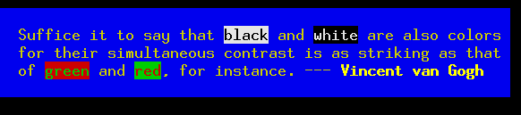
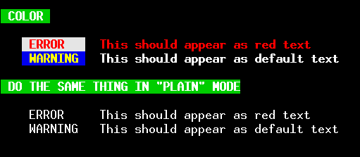

## NAME

### M_attr - use in-band signaling to control the text attributes, formatting, color, and other output options on ANSI video text terminals

## DESCRIPTION

   M_attr(3f) is a Fortran module that writes common ANSI escape
   sequences which control terminal attributes like text color. It is
   designed to allow the sequences to be suppressed and for the user
   program to completely customize it -- the user can add, delete and
   replace the sequences associated with a keyword without changing
   the code.

## FUNCTIONAL SPECIFICATION

   Attributes are specified by writing lines with HTML-like structure.

   **This is how the interface works --**

   Call the attr(3f) function with strings that include syntax like
   "\<attribute\> My regular text \</attribute\>" and the "attribute"
   and "/attribute" names will be replaced with ANSI escape sequences or
   user-defined strings associated with those keywords.
```fortran
   program demo_M_attr
   use M_attr, only : attr
      print *, attr('<GREEN><bold><white> Hello World!</white></bold></GREEN><reset>')
      ! or
      print *, attr('<G><bo><w> Hello World!')
   end program demo_M_attr
```

## USER DOCUMENTATION

### Individual man-pages

 - An [index](https://urbanjost.github.io/M_attr/man3.html) to HTML versions
   of the manpages describes all the routines. Alternatively, they may be accessed individually:
   - [M_attr](https://urbanjost.github.io/M_attr/M_attr.3M_attr.html)  -- An overview of the M_attr module
   - [attr](https://urbanjost.github.io/M_attr/attr.3M_attr.html)  -- the main function
   - [attr_mode](https://urbanjost.github.io/M_attr/attr_mode.3M_attr.html)  -- setting processed or plain output mode
   - [attr_update](https://urbanjost.github.io/M_attr/attr_update.3M_attr.html)  -- customizing

### All manpages amalgamated

 - Another view of these documents (that uses javascript to combine all
   the HTML descriptions of the manpages) is in a
   [book_](https://urbanjost.github.io/M_attr/BOOK_M_attr.html) form that can easily be printed
   as a single document.

Tthese documents are contained in the docs/ directory along with one
more forat - archive files of man(1) pages that can be installed on ULS
(Unix-Like Systems):

    + [manpages.zip](https://urbanjost.github.io/M_attr/manpages.zip) 
    + [manpages.tgz](https://urbanjost.github.io/M_attr/manpages.tgz) 

## DOWNLOAD
   ```bash
       git clone https://github.com/urbanjost/M_attr.git
       cd M_attr/src
       # change Makefile if not using one of the listed compilers
       make clean; make gfortran    # for gfortran
       make clean; make ifort       # for ifort 
       make clean; make nvfortran   # for nvfortran
   ```
   This will compile the M_attr module and example programs.

## SUPPORTS FPM 

   Alternatively, download the github repository and build it with
   fpm ( as described at [Fortran Package Manager](https://github.com/fortran-lang/fpm) )

   ```bash
        git clone https://github.com/urbanjost/M_attr.git
        cd M_attr
        fpm test
   ```

   or just list it as a dependency in your fpm.toml project file.

```toml
        [dependencies]
        M_attr        = { git = "https://github.com/urbanjost/M_attr.git" }
```

## EXAMPLE PROGRAMS
The included demo programs provide templates for the most common usage:

- [demo1](test/default.f90) simple demo setting color
- [demo5](test/custom.f90)  how to add, delete, and replace attribute strings
- [demo9](test/mixed.f90)   multiple modes and mixed attributes

- [demo6](test/dump.f90)    dump the dictionary. Intended for debugging but might be generally useful.

- [demo7](test/functional.f90)  use attr(3f) instead of attr(3f) for a more functionally-oriented programming interface

- [plain text](app/plain.f90)   a simple filter program that strips "raw mode" output back to plain text

- [in color](app/light.f90) a filter program that displays a "raw mode" input file in color
                            (or displays command line arguments). So you
                            can read in a file generated in "raw" mode
                            and display it in color, or use it for testing
                            commands or for adding color from scripts:
```text
        light "<clear><WHITE><blue><bold> WARNING: <reset> that would not be prudent"
```

### A BASIC INTRODUCTORY PROGRAM

This short program will display red and yellow text on an ANSI-compatible color terminal
or terminal emulator:

```fortran
   program demo_M_attr
   use M_attr, only : attr, attr_mode

      write(*,'(/,a,/)')attr('<GREEN><bold><white> COLOR <reset>')
      call printme()

      write(*,'(/,a,/)')attr('<G><bo><w> DO THE SAME THING IN "PLAIN" MODE')
      call attr_mode(manner='plain')
      call printme()

   contains 
   subroutine printme()
      write(*,'(3x,a)') attr('<W><bo><r> ERROR   </W>  This should appear as red text</y>')
      write(*,'(3x,a)') attr('<B><bo><y> WARNING </B></y>  This should appear as default text')
   end subroutine printme

   end program demo_M_attr
```


### NOTE:
   where supported the isatty(3f) function can be used to turn off the sequences when the file is
   not a tty.  isatty(3f) is an extension, but supported by GNU, Intel, PGI, ...

---
## [CHANGELOG](CHANGELOG.md)
---
## [HISTORY](HISTORY.md)
---
## DEVELOPER DOCUMENTATION
### doxygen

- [doxygen(1) output](https://urbanjost.github.io/M_attr/doxygen_out/html/index.html).

### ford

- [ford(1) output](https://urbanjost.github.io/M_attr/fpm-fordindex.html).
---
### REFERENCES
* [**Fortran Wiki example**](http://fortranwiki.org/fortran/show/ansi_colors) for an example that covers the basics
* [**Rosetta Code examples**](https://rosettacode.org/wiki/Terminal_control/Coloured_text) for how other languages do color.
  I find the Ncurses, Fortran, bash and C++ examples particularly interesting.
* [**Wikipedia**](https://en.wikipedia.org/wiki/ANSI_escape_code) a description of the basic ANSI escape sequences.
* [**FACE**](https://github.com/szaghi/FACE) A Fortran library for generating ANSI escape sequences
* [**foul**](http://foul.sourceforge.net/) A library for controlling the attributes of output text using Fortran
* [**Fortran Standard Library project**](https://github.com/fortran-lang/stdlib/issues/229) discussion about
  adding ANSI control sequences to the Fortran Standard Library project.
* [terminal colors](http://www.pixelbeat.org/docs/terminal_colours/)

### OF INTEREST
* [ansi2html](https://github.com/ralphbean/ansi2html) ANSI escape codes to HTML from programs and as a bash shell
* [M_ncurses](https://github.com/urbanjost/M_ncurses) A Fortran interface to Ncurses(3c)

### OTHER LANGUAGES

*  [python](https://python-prompt-toolkit.readthedocs.io/en/master/pages/printing_text.html#html) prompt-toolkit

## FEEDBACK

Please provide feedback on the
[wiki](https://github.com/urbanjost/M_attr/wiki) or in the
[__issues__](https://github.com/urbanjost/M_attr/issues) section
and please star the repository if you use the module (or let me know
why not and let others know what you did use!).
-------
